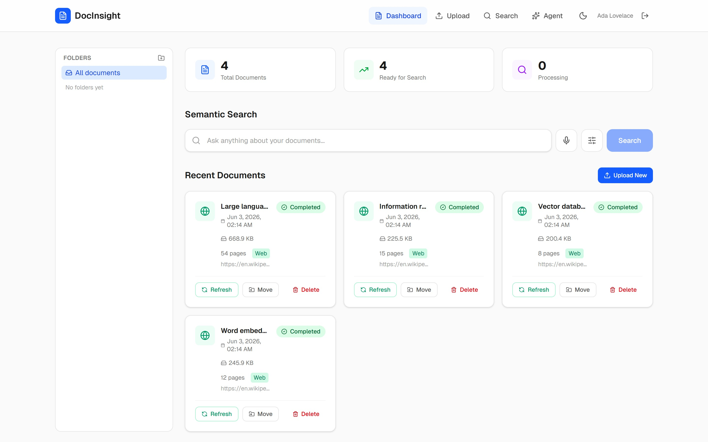
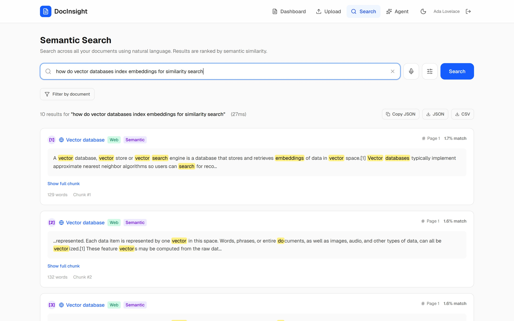
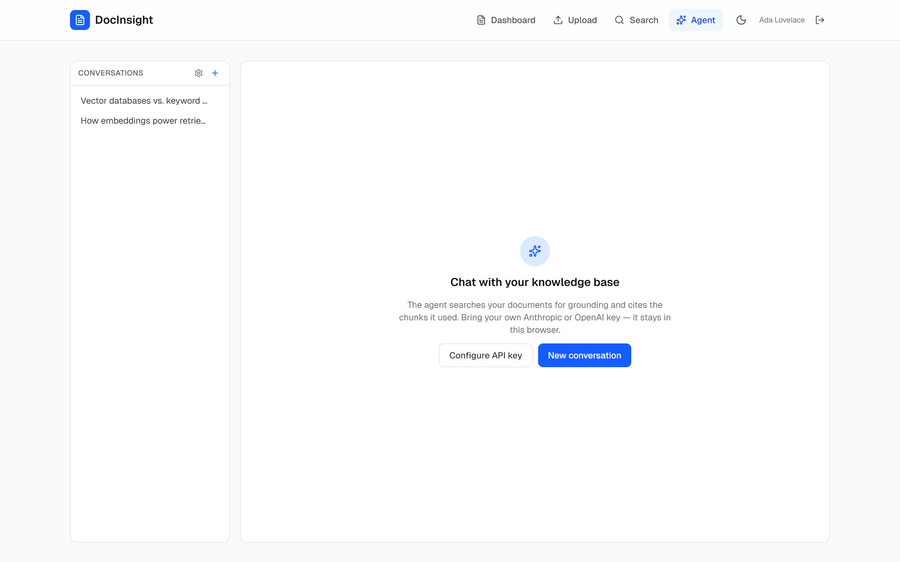
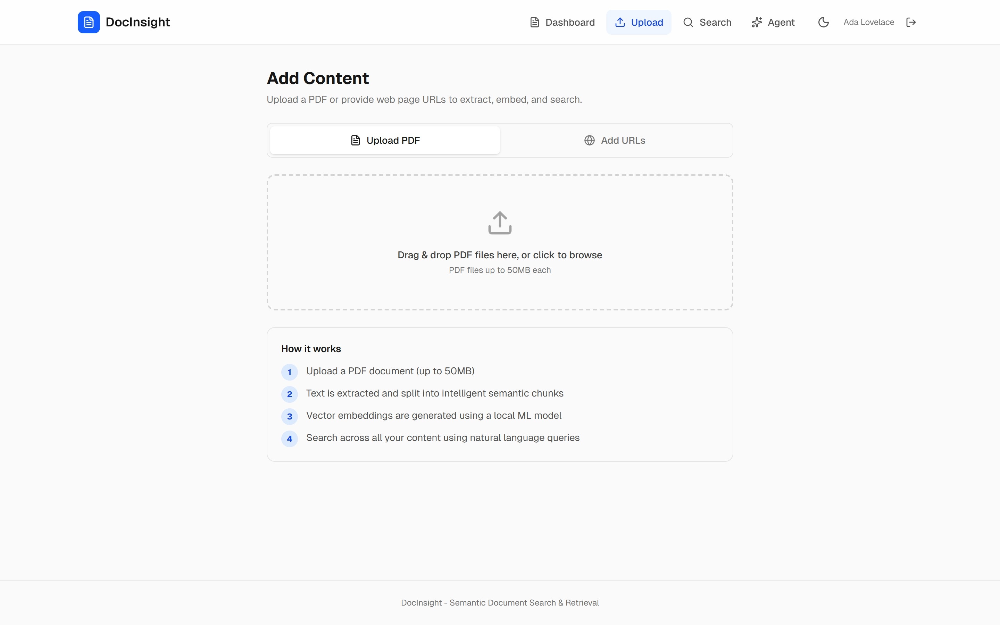

# DocInsight

**Semantic document search with a bring-your-own-key AI agent.**

DocInsight ingests your PDFs and web pages, indexes them for meaning-based search
(not just keywords), and lets an AI agent answer questions grounded in your own
library — with inline citations back to the source chunk. You supply your own
Anthropic or OpenAI API key; it is forwarded per request and **never stored on
the server**.

[](LICENSE)


---

## Table of contents

- [Features](#features)
- [Screenshots](#screenshots)
- [Architecture](#architecture)
- [Tech stack](#tech-stack)
- [Getting started](#getting-started)
- [Configuration](#configuration)
- [Testing](#testing)
- [How the agent works](#how-the-agent-works)
- [Project structure](#project-structure)
- [Privacy](#privacy)
- [License](#license)

---

## Features

### Ingestion & search
- **Bulk PDF upload** with a six-stage processing pipeline (extract → chunk →
  store → embed → index → complete), plus an **OCR fallback** (Tesseract) that
  kicks in automatically when a PDF's extracted text is too sparse.
- **Web-page ingestion** — paste URLs to fetch and index article content, with
  optional **recursive same-domain crawling**.
- **Hybrid search** — full-text (SQLite FTS5/BM25) and semantic (cosine
  similarity) results fused with **Reciprocal Rank Fusion** (RRF, _k_ = 60).
  Search by keyword, by meaning, or both.
- **Highlighted snippets** with stopword-aware tokenization and earliest-match
  windowing.
- **Hierarchical folders** (recursive-CTE subtree scoping) and **tags** for
  organizing a library.

### AI agent
- **Bring-your-own-LLM** chat over your documents — streaming responses from
  **Anthropic** or **OpenAI**.
- A tool-calling loop with **five grounded tools**: `search_documents`,
  `get_document`, `summarize_document`, `list_documents`, and
  `get_chunk_context`.
- **Inline citations** — answers cite the exact source chunk
  (`<cite chunk="…"/>`), rendered as numbered, expandable sources.
- **Live tool status** — the UI shows "Searching for…", "Reading…",
  "Summarizing…" as the agent works, streamed over Server-Sent Events.
- **Voice input** — dictate queries and prompts via the browser's Web Speech
  API (100% client-side; no audio reaches the server).

### Platform
- **Multi-tenant** API-key auth (opt-in); every record is scoped to a user.
- **Real-time updates** over SSE for processing and search events.
- **Pluggable storage** — zero-setup **SQLite** for local development,
  **PostgreSQL/pgvector** for production (auto-selected via `DATABASE_URL`).
- **Export** search results to JSON or CSV.

---

## Screenshots

| | |
|:--:|:--:|
|  |  |
| **Document library** — mixed PDF & web sources, processed and ready to search | **Hybrid search** — ranked results with highlighted matches and citations |
|  |  |
| **AI agent** — grounded in your library, bring-your-own key | **Add content** — upload PDFs or ingest &amp; crawl web pages |

---

## Architecture

DocInsight is a three-tier system: a Next.js frontend, a Go API that owns all
ingestion/search/agent logic, and a small Python sidecar dedicated to producing
embeddings.

```
                      ┌────────────────────────────┐
    Browser  ───────▶ │  Next.js 16 (App Router)   │  :3000
                      │  React 19 · Tailwind 4     │
                      └─────────────┬──────────────┘
                                    │  REST + SSE
                                    ▼
                      ┌────────────────────────────┐
                      │  Go API  ·  chi router     │  :8080
                      │  ────────────────────────  │
                      │  ingest · chunk · OCR      │
                      │  hybrid search (FTS5 + cos)│
                      │  SSE broker · agent loop   │
                      └───┬────────────┬───────┬───┘
              embeddings  │       data │       │  chat completions
                          ▼            ▼       ▼
                ┌──────────────┐  ┌─────────┐  ┌────────────────────┐
                │ Python       │  │ SQLite  │  │ Anthropic / OpenAI │
                │ FastAPI      │  │   or    │  │  (your API key,    │
                │ MiniLM-L6-v2 │  │ Postgres│  │   forwarded only)  │
                │    :8000     │  └─────────┘  └────────────────────┘
                └──────────────┘
```

- **Frontend** (`/src`) — App Router pages for `/`, `/upload`, `/search`,
  `/agent`, `/documents/[id]`, and `/login`. State via Zustand; SSE via an
  `EventSource` hook with auto-reconnect.
- **Backend** (`/backend`) — chi router, a non-blocking SSE event broker, a
  channel-based job queue with crash recovery, and a brute-force cosine + FTS5
  hybrid search engine. The agent loop runs the LLM tool-calling cycle (max 5
  iterations) and extracts citations from the final answer.
- **Embedding sidecar** (`/backend/embedding-sidecar`) — a FastAPI service that
  serves `all-MiniLM-L6-v2` embeddings. **Required** for ingestion and search.

---

## Tech stack

| Layer | Technologies |
| --- | --- |
| Frontend | Next.js 16.2 (App Router), React 19, TypeScript, Tailwind CSS 4, Zustand, lucide-react |
| Backend | Go (chi router), `modernc.org/sqlite`, Server-Sent Events |
| Search | SQLite FTS5 (BM25) + brute-force cosine, fused with RRF |
| Embeddings | Python FastAPI sidecar · `all-MiniLM-L6-v2` |
| LLM | Anthropic Messages API · OpenAI Chat Completions (streaming, BYO key) |
| Storage | SQLite (dev) · PostgreSQL/pgvector (prod) |
| OCR | Tesseract (optional) |
| Tests | Go `testing` · Vitest + Testing Library + happy-dom |

---

## Getting started

### Prerequisites
- **Go** 1.23+
- **Node.js** 20+ and npm
- **Python** 3.11+ (for the embedding sidecar)
- **Tesseract** (optional, for OCR of scanned PDFs)

### Installation

```bash
# 1. Frontend dependencies
npm install

# 2. Backend dependencies
cd backend && go mod download && cd ..

# 3. Embedding sidecar (one-time)
cd backend/embedding-sidecar
python -m venv .venv
source .venv/bin/activate        # Windows: .venv\Scripts\activate
pip install -r requirements.txt
cd ../..
```

### Running locally

DocInsight runs as three processes. Start each in its own terminal:

```bash
# Terminal A — embedding sidecar (required)
cd backend/embedding-sidecar
source .venv/bin/activate          # Windows: .venv\Scripts\activate
uvicorn main:app --port 8000

# Terminal B — Go API (auth enabled so the agent works)
AUTH_ENABLED=true go run ./backend/cmd/server

# Terminal C — Next.js frontend
npm run dev
```

Then open **http://localhost:3000**, register a user, and add your LLM API key
from the agent page's settings to start chatting with your documents.

> **Windows note:** if Go is not on your `PATH`, run backend commands through Git
> Bash with a prefix:
> `export PATH="/c/Program Files/Go/bin:$PATH"`.

---

## Configuration

The backend is configured via environment variables (sensible defaults shown):

| Variable | Default | Purpose |
| --- | --- | --- |
| `AUTH_ENABLED` | `false` | Enforce API-key auth. **Required for the agent.** |
| `DATABASE_URL` | _(unset)_ | PostgreSQL connection string. SQLite is used if unset. |
| `OCR_ENABLED` | `false` | Enable Tesseract OCR fallback for sparse-text PDFs. |
| `TESSERACT_PATH` | _(auto)_ | Path to the `tesseract` binary. |
| `OCR_MIN_TEXT_RATIO` | `0.02` | Trigger OCR when extracted text falls below this ratio. |

Frontend (`.env.local`):

| Variable | Default | Purpose |
| --- | --- | --- |
| `NEXT_PUBLIC_API_URL` | `http://localhost:8080` | Base URL of the Go API. |

**Auth model:** the backend issues `di_`-prefixed API keys
(`Authorization: Bearer di_…`). Your **LLM** key is separate — stored only in the
browser's `localStorage` and forwarded per request as `X-LLM-API-Key`.

---

## Testing

```bash
# Backend (Go) — 233 passing / 0 skipped / 0 failed
cd backend && go test ./... -count=1
go vet ./...

# Frontend unit tests (Vitest) — 14 passing
npm run test:run

# Production build (type-checks all routes)
npx next build
```

---

## How the agent works

When you send a message, the Go backend runs a bounded tool-calling loop:

1. The user message and tool schemas are streamed to your chosen LLM.
2. If the model calls a tool, the backend's **dispatcher** executes it
   (all tenant-scoped to your user), streams a friendly status to the UI, and
   feeds the result back to the model.
3. Tools that return chunks attach **citations**; `summarize_document` issues a
   bounded nested LLM call using your key.
4. The loop repeats (up to 5 iterations) until the model produces a final answer,
   whose `<cite chunk="…"/>` markers are resolved into an expandable source list.

SSE deltas drive the live UI optimistically; on completion the client refetches
the authoritative persisted message, so the final state is always correct even if
streamed events are dropped under backpressure.

---

## Project structure

```
.
├── src/                          # Next.js frontend (App Router)
│   ├── app/                      # routes: /, /upload, /search, /agent, ...
│   ├── components/               # UI: search bar, agent message, mic button, ...
│   ├── hooks/                    # useSSE, useSpeechRecognition
│   └── store/                    # Zustand app store
├── backend/
│   ├── cmd/server/               # entry point, DI wiring, graceful shutdown
│   ├── internal/
│   │   ├── agent/                # LLM tool-calling loop + tool dispatcher
│   │   ├── handler/              # HTTP handlers (documents, search, agent, auth)
│   │   ├── store/                # SQLite + Postgres stores, FTS5 + cosine search
│   │   ├── llm/                  # Anthropic + OpenAI streaming clients
│   │   ├── chunker/ embedder/    # text chunking + sidecar client
│   │   ├── worker/ queue/        # job pool + channel queue
│   │   ├── scraper/ crawler/ ocr/# web ingestion + OCR
│   │   └── events/               # SSE event broker
│   └── embedding-sidecar/        # Python FastAPI embedding service
├── HANDOFF.md                    # full developer handoff
└── LESSONS_LEARNED.md            # running log of decisions & gotchas
```

For deeper context — what's implemented, conventions, and design rationale — see
[`HANDOFF.md`](HANDOFF.md) and [`LESSONS_LEARNED.md`](LESSONS_LEARNED.md).

---

## Privacy

- **Your documents stay on your infrastructure** (local SQLite or your own
  Postgres).
- **Your LLM API key is never persisted server-side** — it lives in your
  browser and is forwarded per request, then dropped.
- **Voice input is fully client-side** via the Web Speech API. Audio is handled
  by your browser vendor (e.g. Chrome → Google, Safari → on-device); DocInsight
  never receives audio bytes.

---

## License

Released under the [MIT License](LICENSE). © 2026 jibkh.
